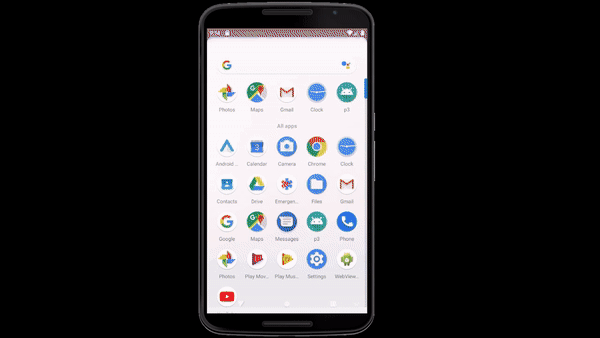

# P3-GetInspired
An android app combining APIs to deliver inspirational quotes and wikipedia entries of their authors

The app uses and combines a few APIs into a app, it uses one API to get inspiring quotes, one API to get a nice and inspiring picture to have as background and lastly is used a Wikipedia API to find information about the author of the quote.

